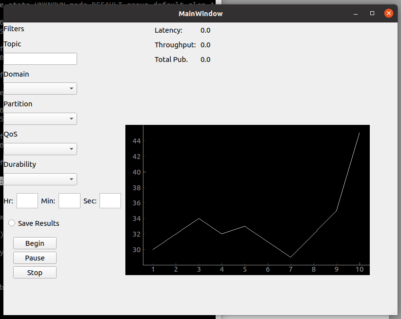

# ddsSniff
Packet sniffer to sniff Real-Time Publish Subscribe packets on a host machine using optional DDS filters such as topics and QoS.  Included GUI for bandwidth viualization and network analysis.  

